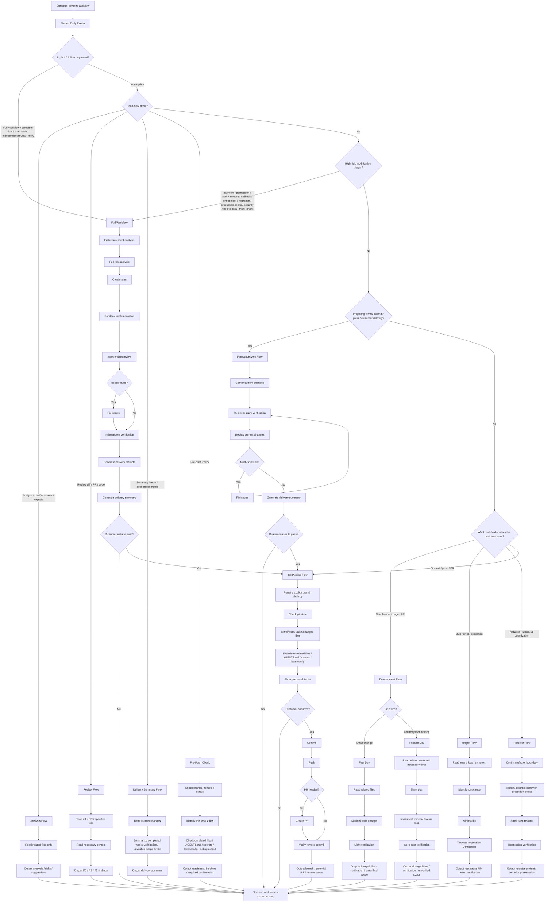

# AI Engineering Workflow

[](LICENSE)

AI development workflow contracts and adapters for keeping Claude Code and Codex changes scoped, practical,
verifiable, and easy to hand off. The default daily path is direct scoped development with guardrails: read only
relevant context, make the smallest useful change, run practical verification, and report what remains
unverified. The full audited pipeline remains available for high-risk modification or explicitly requested
full-flow work.

Claude Code and Codex now share the same daily routing contract and product positioning: a lightweight
`ai-engineering-workflow` entry, deterministic daily routing, pre-push safety checks, and escalation to the
existing Claude Code Dynamic Workflows when risk or explicit user intent requires it. `core/` owns the shared
route/status/safety decisions; `bin/` exposes cross-platform CLIs; `.claude/` and `.agents/` are adapter layers,
not separate methodologies. Codex Full Workflow is not positioned as a one-off experiment: it remains the
complete feature/project delivery path and is suitable for full project development. The current optimization is
about making everyday development smoother, cheaper, and less ceremonial while keeping the complete workflow
available when the task asks for it or risk requires it. In practice, the workflow is a daily router, not a
default full pipeline. Recorded validation includes a real Windows 10 + Codex multi-subagent end-to-end run with
analysis, implementation, independent review, fix, independent verification, tests, commit, and remote push.

## Daily Router

All adapters route through the shared Daily Router before heavy workflow contracts or agent fan-out:

```text
node "<toolkit-root>/bin/core.mjs" daily-route --stdin
```

Read-only intent is classified before high-risk modification escalation. High-risk terms inside analysis,
review, delivery summary, or pre-push requests stay read-only and are returned with warnings; they do not start
the full implementation pipeline unless the user separately asks for a modification.



## What This Does

For Codex daily work, ordinary development requests implicitly use the `/dev-fast` behavior. The primary
commands are:

| Command | Purpose | Output |
| --- | --- | --- |
| `/dev-fast` | Default fast development for pages, components, CRUD, DTOs, ordinary APIs, small fixes | minimal direct edit, light verification, changed files, unverified scope |
| `/dev-feature` | Ordinary feature path for small modules, API sets, CRUD features, or frontend-backend loops | concise plan, scoped implementation, light verification |
| `/review-changes` | Review the current diff only | findings ordered by severity |
| `/delivery-summary` | Prepare handoff/demo/merge notes | changed files, behavior, checks, risks |
| `/pre-push-check` | Check whether current changes are safe to commit or push | branch/remote, task files, unsafe files, verification gaps, required confirmation |
| `/critical-check` | Escalate high-risk modification work | full plan/sandbox/review/verify artifacts |

Critical triggers include payment, permissions, authentication, amount calculation, third-party callbacks,
entitlements, database migration, production config/data, deletion, security, and multi-tenant isolation. They
escalate modification tasks only; read-only analysis/review/summary/pre-push requests stay read-only with
warnings.

Ordinary database CRUD is not database migration. Normal query, mapper, DTO/VO, pagination, filter, and
non-destructive table read/write changes should use `/dev-fast` or `/dev-feature` unless they also change
schema, migrate data, touch production data, change permissions, or hit another high-risk trigger.

Phrases such as "complete page", "complete CRUD", or "complete feature" do not trigger Full Workflow by
themselves. Price labels, design tokens, JavaScript callbacks, token counts, and pricing-page styling are also
ordinary daily work unless paired with a real high-risk trigger.

## Verification Levels

| Scenario | Recommended verification |
| --- | --- |
| Text, style, small component, small field | `git diff --check`, then the smallest relevant build/lint/test item |
| Ordinary frontend change | build/lint or focused page smoke check covering the core loading, interaction, or error state |
| Ordinary backend change | compile or focused test; smoke one core API when practical |
| Ordinary frontend-backend loop | request parameters, response fields, loading state, error message, and duplicate-submit behavior |
| Before submit, handoff, commit, or push | git status, task-file scope, unsafe files, actual verification commands, delivery summary |
| High-risk modification logic | Full Workflow with analysis, plan, sandbox implementation, independent review, and independent verification |

Daily final responses should stay short:

```text
Changed:
Verified:
Unverified:
Risk:
Files:
```

## Daily Closed-Loop Delivery

When the `ai-engineering-workflow` Skill is explicitly invoked for a modification task, the default result is
not just edited files. The daily closed-loop path is:

```text
implement -> verify -> pre-push check -> commit exact task files -> push normally -> verify remote HEAD
```

This is still the lightweight daily path, not Full Workflow. It does not create formal plan artifacts, use a
sandbox implementation, or require independent review/verification unless the task hits a Full Workflow
trigger.

The loop stops before git writes when:

- the user says not to commit, not to push, not to publish, not to open/create a PR, or asks to only
  check/review/analyze;
- unrelated or unsafe changes cannot be separated confidently;
- required verification fails;
- branch, remote, or publish strategy is ambiguous;
- `AGENTS.md`, `.env`, token/key files, personal config, generated local output, debug logs, or other unsafe
  files would be included;
- the publish target is protected or high risk and needs explicit opt-in.

The publish-intent Pre-Push Check requires an explicit branch strategy. Use:

```text
node "<toolkit-root>/bin/pre-push-check.mjs" --cwd <repo> --branch-mode <current-branch|new-branch|switch-existing>
```

Omitting `--branch-mode` blocks publish readiness with an explicit-branch-strategy reason. Use `--snapshot-only`
only for a non-publish safety snapshot.

## Daily Examples

### Frontend Button, Form, Or Page Change

Use:

```text
/dev-fast
Adjust the order form loading and empty states.
```

Expected behavior: read the related page/component files, make the smallest UI/state change, run build/lint
or state the manual page checks, then report changed files and unverified interactions.

### Ordinary Backend CRUD Or DTO/API Change

Use `/dev-fast` for small field/DTO/query changes, or `/dev-feature` for a small closed CRUD path:

```text
/dev-feature
Add a normal admin CRUD endpoint for coupon categories with pagination.
```

Expected behavior: concise plan, reuse existing controller/service/mapper patterns, compile or run focused
tests, optionally smoke the core API. No independent review or sandbox delivery by default.

### Payment, Permission, Callback, Or Migration

Use:

```text
/critical-check
Change the payment callback idempotency and member entitlement activation flow.
```

Expected behavior: full critical flow with plan artifacts, sandbox delivery, independent review and
verification when available, and explicit remaining risk.

## Formal Pipeline

The formal artifact pipeline is retained for `/critical-check`, explicit formal delivery, and the Claude
adapter:

| Input | Workflow | Output |
| --- | --- | --- |
| A user requirement plus a target repository | `plan-from-requirement` | `final-plan.md`, `plan.json`, risks, tests, and `readinessForDev` |
| A ready plan plus the same target repository | `deliver-from-plan` | sandboxed implementation, `changes.diff`, delivery report, verification notes |
| A verified delivery (diff + `DELIVERED` manifest) plus a git remote | `publish-delivery` | automatic branch/commit/push (no PR) with independent post-push remote verification |
| A repository audit request | `analyze-repo` | evidence-backed risk report and test plan |

The main chain is intentionally split:

1. `plan-from-requirement`: read-only requirement analysis and implementation plan.
2. Human gate: review `final-plan.md`; continue only when `readinessForDev=ready`.
3. `deliver-from-plan`: sandbox implementation from the approved plan.
4. Human gate: inspect `delivery-report.md`, `changes.diff`, and verification notes.
5. `publish-delivery`: optional automatic branch/commit/push when the manifest is `DELIVERED` and the customer
   authorizes publishing.

Run the repository self-check before publishing workflow changes:

```text
node scripts/self-check.mjs
```

Claude Code Dynamic Workflows can also be resumed from a saved workflow script when needed:

```text
Workflow({ scriptPath: "<path-to-workflow.js>" })
```

See [examples/minimal-target](examples/minimal-target/) for the tiny deterministic fixture used by the workflow
artifact tests.
